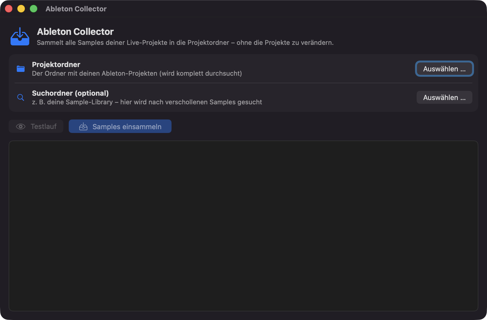

#  Ableton Collector

Native macOS-App, die **„Sammeln und Sichern" für alle Ableton-Live-Projekte auf einmal** erledigt – ohne Ableton zu öffnen und ohne durch jedes Projekt einzeln zu klicken.

*(Native macOS app that batch-runs the equivalent of Ableton Live's "Collect All and Save" across all your projects at once — without opening Live.)*



## Was macht die App?

Ableton-Projektdateien (`.als`) **verlinken** Samples nur – beim Umzug auf einen anderen Rechner fehlen dann alle Samples, die außerhalb des Projektordners lagen. Diese App:

1. durchsucht einen Ordner rekursiv nach allen `.als`-Dateien (automatische `Backup/`-Kopien werden übersprungen),
2. liest jede Projektdatei (gzip-komprimiertes XML) und findet alle referenzierten externen Samples und Presets,
3. kopiert fehlende Dateien in den jeweiligen Projektordner (`Samples/Collected` bzw. `Presets`),
4. meldet alles, was nirgends mehr auffindbar ist – **bevor** man beim Umzug etwas vergisst.

Optional kann ein **Suchordner** (z. B. die eigene Sample-Library) angegeben werden: Verschollene Samples werden dort per Dateiname (und Dateigröße, falls bekannt) wiedergefunden.

**Wichtig:** Die `.als`-Dateien werden **niemals verändert**. Die Samples werden nur in den Projektordner kopiert – Ableton Live findet sie dort beim nächsten Öffnen über die automatische Suche im Projektordner selbst wieder.

## Benutzung

1. `Ableton Collector.app` starten (beim ersten Mal: **Rechtsklick → Öffnen**, da die App nicht notariell beglaubigt ist)
2. Projektordner auswählen (oder per Drag & Drop auf das Fenster ziehen)
3. Optional: Suchordner (Sample-Library) auswählen
4. Erst **Testlauf** klicken – zeigt nur an, was passieren würde
5. Dann **Samples einsammeln**

Unterstützt Projekte aus Live 9 bis Live 12. Läuft auf macOS 13+ (Apple Silicon und Intel).

## Selbst bauen

Benötigt nur die Xcode Command Line Tools (`xcode-select --install`):

```bash
./build.sh
```

Ergebnis: `build/Ableton Collector.app` (Universal Binary, ad-hoc signiert) und `build/AbletonCollector.zip`.

## Credits

Die Sammel-Logik ist ein Swift-Port des CLI-Tools [arod1213/collect-and-save](https://github.com/arod1213/collect-and-save) (Zig).

## Lizenz

MIT
